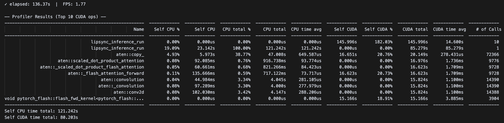
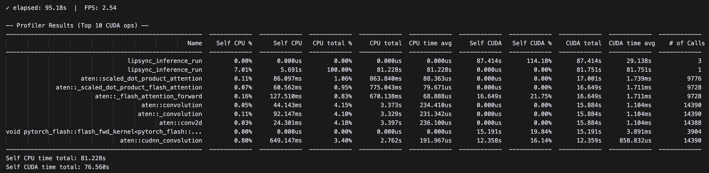

<h1 align="center">LatentSync</h1>

## My Work:

# Part 1: Performance Optimization

torch.profiler implemented to profile the current inference pipeline. For the inference, stage2_512.yaml config file is used.

Warm-up run added (run_pipeline()) because the first execution of CUDA operations often includes one-time initialization costs, this period was excluded from profiling.

Run the below command to run profiling script. 

```bash
./inference_profiler.sh
```

### Summary of Profiling Findings:

Throughput: 1.77 FPS

Total CUDA active time: ~80.2 s ⇒ GPU busy ≈ 80.2 / 136.4 ≈ 59% → ~41% idle / waiting on CPU or H2D/D2H copies.

### Primary bottlenecks:

aten::copy_ 72k calls, 47.0 s CPU, 20.1 s CUDA 
Massive number of aten::copy_ calls → CPU-GPU sync & memory bandwidth bound; likely host<->device thrash and intermediate .cpu()/.numpy() hops.

GPU underutilization (~59%) due to launch overheads, CPU-side preprocessing/postprocessing, and sync points inside lipsync_inference_run.

(_flash_attention_forward, _scaled_dot_product_flash_attention) ~16.6 s (20.7% CUDA)
Convolutions (aten::conv2d family, 14,3k calls) 15.8 s (19.7% CUDA)
Attention + Conv blocks still large on-GPU (≈ ~40% of CUDA time combined)


<summary>Baseline Profiler Results (Top 15 CUDA ops)</summary>

<p align="center">

<p>

Optimizations made:

- Added `align_warp_face_gpu()` method that keeps data on GPU
- Eliminates `.cpu().numpy()` conversion in the main processing path
- Returns GPU tensors directly instead of numpy arrays
- Uses `torch.nn.functional.interpolate` for GPU-based resizing
- Added `affine_transform_batch()` method for batch processing
- Added `preload_video_to_gpu()` method to preload video frames
- Optimized `affine_transform()` to handle GPU tensors better
- Updated `affine_transform_video()` to use batch processing
- Updated `restore_video()` to minimize CPU-GPU transfers


After the optimization, performance improvement achieved:

<summary>Optimized Profiler Results (Top 15 CUDA ops)</summary>

<p align="center">

<p>

Baseline → Optimized:

Total time dropped from 136.4s → 95.2s (↓ 30%).

FPS increased 1.77 → 2.54 (↑ 43.5%).

CPU time dropped by 40s, mainly by removing aten::copy_ overhead.

GPU utilization improved to ~80%, but attention+conv still 40% of CUDA time.

Eval scripts is used woth baseline pipeline and optimized pipeline and there is no decrease in SyncNet confidence (./eval/eval_sync_conf.sh)

Before  →  After

 8.39  →  8.58

For remaining bottlenecks, TensorRT conversion can bring major speedup. 
Flash Attention: Still consuming ~16.6s (unchanged)
Convolution ops: Still consuming ~15.9s (unchanged)

# Part 2: Quality Enhancement

Below lip-sync related papers were analysed to propose improvements.

Style-Preserving Lip Sync via Audio-Aware Style Reference (https://arxiv.org/html/2408.05412v1), 

MUSETALK: REAL-TIME HIGH QUALITY LIP SYNCHRONIZATION WITH LATENT SPACE INPAINTING (https://arxiv.org/pdf/2410.10122v2),

StyleTalk: One-shot Talking Head Generation with Controllable Speaking Styles (https://arxiv.org/pdf/2301.01081),

SayAnything: Audio-Driven Lip Synchronization with Conditional Video Diffusion (https://arxiv.org/pdf/2502.11515),

FLUENTLIP: A PHONEMES-BASED TWO-STAGE APPROACH FOR AUDIO-DRIVEN LIP SYNTHESIS WITH OPTICAL FLOW CONSISTENCY (https://arxiv.org/pdf/2504.04427)

## 1- Observed Limitations in LatentSync:

Based on hands-on evaluation of LatentSync v1.6 at 512×512 resolution the following residual limitations emerge:

### Weak Exploitation of Phoneme-Level Semantics
LatentSync relies solely on SyncNet, which delivers only coarse binary alignment (matching vs. non‑matching), missing fine-grained phoneme-level misalignments—especially on fast or ambiguous speech (e.g., fricatives or plosives)

### Static Condition Balancing
The model uses fixed guidance (CFG + SyncNet + TREPA), lacking dynamic per-frame balancing of identity, audio, and style signals. SayAnything shows that explicit condition modules improve lip-teeth coherence and region-specific fidelity

### No speaking style modeling
Individuals articulate differently even for identical utterances. Style‑Preserving Lip Sync shows style-aware reference injection preserves identity-specific articulation, a component LatentSync lacks

### Uniform temporal consistency
While TREPA improves general temporal consistency, it applies globally. No special weighting is given to critical mouth regions, leading to residual flicker in the lips/teeth area at high resolution

### Efficiency and sampling steps
LatentSync uses standard ε-prediction with 20 DDIM steps. Related systems like MuseTalk achieve fast inference with fewer steps via latent inpainting and strategic sampling, suggesting possible efficiency gains

## 2- Proposed Improvements to Enhance Lip‑Sync Quality
### Improvement 1: Phoneme‑Aware Alignment Head
SyncNet provides only coarse supervision. FluentLip and related methods show that phoneme-level alignment (via CTC or viseme training) significantly improves lip intelligibility and accuracy.
With this one, more precise lip movements, especially for subtle phonemes (e.g., “s”, “th”) and reduction in lip‑sync errors and improved SyncConf scores are expected.

### Improvement 2: Weighted Temporal Losses 
Flicker and jitter in mouth/teeth regions may persist because TREPA does not focus on them. Weighting the loss over a mouth mask can better drive consistency where it matters. Modifying TREPA to a weighted version emphasizing mouth ROI can generate result of higher temporal smoothness in lips/teeth movements; fewer artifacts, improved perceived synchronization.

### Improvement 3: Dynamic Conditioning Weighting
Inspired by SayAnything’s modular conditioning architecture, dynamically balancing identity, audio, and optional style signals per frame and region may resolve conflicts between identity preservation and sync accuracy. Adding a simple balancing module that outputs per-frame weights for audio vs. identity conditioning, applied in cross-attention layers. For POC, similar implement like increases audio weight during high-expression segments, decreasing it in static ones can be applied. As a result, better naturalness in lip motion, preserving expressive styles while maintaining identity can be expected.

## 3- Implementation Plan for Proof-of-Concept
 I recommend Improvement 1 (Phoneme‑Aware Head) since the target is observed issues directly.

 To implement, HDTF or Voxceleb2 data can be used to generate dataset.
 Whisper can be used to generate forced phoneme alignments for these frames. Add Phoneme head and CTC loss, train stage‑2 only. 

## 4- Reasoning and Expected Impact:

 With minimal added complexity to LatentSync v1.6., Phoneme‑Aware Supervision will deliver finer-grained mouth motion correspondence to speech, reducing lip‑sync mismatches that SyncNet alone misses. 
 
 The phonetic information from Whisper embeddings provides the "what" of speech, while the emotion embedding provides the "how". By combining these two sources of information, the model can learn to generate lip movements that are not only accurate in terms of pronunciation but also congruent with the emotional tone of the speaker. This is a more holistic approach to lip-sync, moving beyond simple phonetic-to-visual mapping.

Increased Realism and Expressiveness: The generated videos will be significantly more realistic and expressive. The model will be able to capture subtle variations in lip shape, muscle tension around the mouth, and even slight changes in facial expression that are tied to emotion.

Improved Naturalness: The lip movements will appear more natural and less robotic, as they will be influenced by the prosody and emotional content of the speech.

Wider Range of Applications: This improvement would make LatentSync more suitable for applications where emotional expression is crucial, such as in virtual avatars, character animation for films and games, and even in more advanced video dubbing where preserving the original actor's emotional performance is key.

#

# Part 3: Production Readiness

## Key Requirements:
Latency: Moderate latency is acceptable (since it is not real-time application). 

Throughput & Concurrency: The system should handle multiple users’ requests concurrently.

Hardware Constraints: Use A100 GPUs (40GB VRAM) for inference. Each video generation task can consume a large amount of VRAM (e.g. ~18 GB per inference for 512×512 resolution), so memory management and batching are crucial.

Failure Modes: Ensure no single point of failure – if a GPU node crashes or a generation job fails (e.g. out-of-memory or other errors), the system should gracefully recover or retry. We need robust error handling and possibly job queuing to retry failed tasks.

Cost Efficiency: Idle GPU instances should be minimized (autoscale down when load is low), and high utilization of GPU via batching and parallelism should be pursued to get the most value from hardware.

## System Architecture
### 1. Kubernetes Deployment: 
The LatentSync inference code needs to be containerized and deploy on Kubernetes for scalability and manageability. Each pod will run an NVIDIA Triton Inference Server hosting the LatentSync model(s). Kubernetes will manage multiple such pods across GPU nodes, allowing horizontal scaling. We’ll use the NVIDIA device plugin to schedule pods with GPU resources (each pod can be scheduled on one A100 GPU by default). A Kubernetes Service will load-balance requests to these pods. This provides high availability: if one pod or node fails, traffic is routed to others. (Runpod can be used to access GPUs and schedule pods automatically)

### 2. Triton Inference Server with Ensemble Pipeline: 
Triton will serve an ensemble model that encapsulates the full lip-sync pipeline. The ensemble can chain multiple steps (models) into one DAG (directed acyclic graph), so data flows on the server GPU without extra transfers. 

- Audio Processing: The first stage uses a speech model (Whisper) to convert the input audio waveform into a mel-spectrogram and then into an audio embedding. This model can be served separately via Triton.

- Video Preprocessing: The reference video is provided as input frames (256×256 or 512×512 face-cropped frames). We can perform preprocessing either on the client side (ensuring video is at 25 FPS, resized, and face-aligned as needed) or as a Triton Python backend stage. For simplicity, we assume the client or a gateway service prepares frames and audio to the correct format. If needed, a Triton Python backend model could accept the video file and perform decoding on GPU (using NVDEC) or CPU.

- Diffusion U-Net: The core LatentSync diffusion model (the U-Net) runs next. It takes the noised latent frames, performs iterative denoising. The model could be optimized (TensorRT engine) to reduce latency per diffusion step.

- Video Post-processing: The output of the diffusion model will be a sequence of generated frames (with lip-synced motion). These frames then need to be encoded back into a video file and combined with the input audio track. This step can be done in a lightweight post-processing service or a Python backend in Triton. For example, a Python backend could take the frames tensor, convert to images, and use ffmpeg to encode an MP4 and mux the original audio.

### 3. Client Interface: 
Clients will interact with the system via a gRPC API (Triton supports both HTTP/REST and gRPC, we prefer gRPC for efficiency). Clients send the audio and video (or video frames) to the server. We will utilize Triton’s gRPC endpoint for inference requests, possibly wrapped by a lightweight API server if needed for authentication or job management. Using gRPC offers lower latency overhead than HTTP and better support for streaming large binary data. We will also enable CUDA Shared Memory transfer for inputs/outputs – the client can register a GPU memory region and copy frames/audio into it, so Triton reads it directly without copying via CPU buffers. This significantly speeds up sending large video frames or receiving output, by avoiding redundant data copies over network and PCIe. 

### 4. Data Flow:
In summary, for each request:

The client sends the input video and audio via gRPC. 
If using shared memory, the video frames tensor and audio tensor are placed in shared CUDA memory for Triton to access.
Triton’s ensemble receives the input. The Whisper sub-model (on GPU) processes audio to an embedding. The embedding and reference frames are fed into the diffusion model which generates the output frames.
Post-processing assembles the frames into the final video and attaches the audio. The completed video is then returned to the client (or stored in a storage bucket with a link).
Total latency will depend on video length (number of frames) and chosen diffusion steps. 

## Performance Optimizations

- Triton Dynamic Batching: We will enable Triton’s dynamic batcher for the diffusion model to improve GPU utilization under concurrent load. Dynamic batching allows the server to combine multiple inference requests that arrive near the same time into one larger batch for a single model execution. In our case, if two users submit requests concurrently, Triton could batch the processing of their frames together on the GPU (up to a configured max batch size). This can increase throughput and GPU efficiency, since the large matrix operations in the model can be amortized over a bigger batch.

- Converting the U-Net model to a TensorRT engine. By compiling to TensorRT, we can benefit from kernel fusion and optimized CUDA kernels, reducing execution time per step.

- Concurrent Model Instances: In addition to batching, Triton can run multiple model instances in parallel if resources allow. We could configure an instance_group for the model to deploy, say, one instance per GPU or even multiple instances per GPU if the model is not fully utilizing the GPU’s compute. Running two inferences concurrently on one GPU could approach 36GB which is borderline but might fit on 40GB if optimized. Max batch sizes must be tested carefully.
 

## Monitoring and Failures

To ensure the system runs smoothly in production, comprehensive monitoring put in place:

- Triton Metrics: Triton Inference Server natively provides a Metrics API (prometheus endpoint at :8002/metrics) exposing GPU utilization, memory, throughput, and latency stats. These metrics can be scraped using Prometheus. Key metrics to monitor per instance: GPU utilization %, GPU memory usage, inference request rate, queue wait time, and latency percentiles. This will tell if we are saturating resources or if requests are waiting too long in queue.

- Profiling in Production: Periodically use Triton’s Performance Analyzer or custom tests to profile inference latency with current models. This ensures our optimizations remain effective and helps decide if we need to add more GPUs or tweak batch sizes.

## Conclusion

This plan leverages NVIDIA Triton Inference Server for high-performance serving with features like dynamic batching and model ensembles to pipeline audio and video models efficiently. By containerizing on Kubernetes, we achieve scalability (multiple GPUs, on-demand autoscaling) and resilience. Latency addressed by using GPU optimizations and allowing asynchronous processing, memory constraints by careful batching and model optimization on A100’s large memory, and failure modes by redundancy and timeouts. Additional measures like gRPC with CUDA shared memory will further optimize data throughput, avoiding network bottlenecks for large payloads. Finally, robust monitoring (Prometheus/Grafana, Triton’s metrics) and alerting will ensure the system remains reliable and any issues are detected early. With this architecture, LatentSync can be deployed as a production-grade, cost-efficient, and scalable service for on-demand lip-synced video generation.

# Part 4: TensorRT Implementation

To achieve further performance gains beyond the initial optimizations, TensorRT conversion was implemented for the core inference models.

### Conversion Process

The TensorRT implementation involved a two-stage conversion process:

1. **ONNX Export**: Models were first converted to ONNX format using `tensorrt_conversion/convert_to_onnx.py`
   - VAE Encoder (with sampling included)
   - VAE Decoder  
   - UNet3D diffusion model

2. **TensorRT Engine Building**: ONNX models were then converted to optimized TensorRT engines using `tensorrt_conversion/convert_to_tensorrt.py`
   - FP16 precision enabled 

### TensorRT Inference Pipeline

TensorRT inference pipeline was implemented in `scripts/inference_tensorrt_optimized.py`:

- **TensorRTEngine**: Generic wrapper for VAE encoder/decoder TensorRT engines
- **TensorRTUNet3DEngine**: Specialized wrapper for UNet3D with multiple input handling
- **TensorRTUNetWrapper**: Interface compatibility layer for the diffusion pipeline
- **TensorRTLipsyncPipeline**: Complete pipeline using TensorRT-accelerated components

### Performance Results

**Baseline → Optimized → TensorRT:**

- **Total time**: 136.4s → 95.2s → 50.36s (↓ 63% overall)
- **FPS**: 1.77 → 2.54 → 4.77 (↑ 169% overall)

TensorRT implementation achieved an additional **47% speedup** over the optimized pipeline and **63% improvement** over baseline.

### Known Issues

 **Video Deformation**: The current TensorRT implementation produces output videos with visual deformation compared to the original PyTorch pipeline. This issue is likely due to:

- Potential numerical instabilities in the converted models
- Shape handling differences in the TensorRT execution context

## 🔥 Updates


- `2025/06/11`: We released **LatentSync 1.6**, which is trained on 512 $\times$ 512 resolution videos to mitigate the blurriness problem. Watch the demo [here](docs/changelog_v1.6.md).

- `2025/03/14`: We released **LatentSync 1.5**, which **(1)** improves temporal consistency via adding temporal layer, **(2)** improves performance on Chinese videos and **(3)** reduces the VRAM requirement of the stage2 training to **20 GB** through a series of optimizations. Learn more details [here](docs/changelog_v1.5.md).

## 📖 Introduction

We present *LatentSync*, an end-to-end lip-sync method based on audio-conditioned latent diffusion models without any intermediate motion representation, diverging from previous diffusion-based lip-sync methods based on pixel-space diffusion or two-stage generation. Our framework can leverage the powerful capabilities of Stable Diffusion to directly model complex audio-visual correlations.

## 🏗️ Framework

<p align="center">

<p>

LatentSync uses the [Whisper](https://github.com/openai/whisper) to convert melspectrogram into audio embeddings, which are then integrated into the U-Net via cross-attention layers. The reference and masked frames are channel-wise concatenated with noised latents as the input of U-Net. In the training process, we use a one-step method to get estimated clean latents from predicted noises, which are then decoded to obtain the estimated clean frames. The TREPA, [LPIPS](https://arxiv.org/abs/1801.03924) and [SyncNet](https://www.robots.ox.ac.uk/~vgg/publications/2016/Chung16a/chung16a.pdf) losses are added in the pixel space.

## 🎬 Demo

<table class="center">
  <tr style="font-weight: bolder;text-align:center;">
        <td width="50%"><b>Original video</b></td>
        <td width="50%"><b>Lip-synced video</b></td>
  </tr>
  <tr>
    <td>
      <video src=https://github.com/user-attachments/assets/b778e3c3-ba25-455d-bdf3-d89db0aa75f4 controls preload></video>
    </td>
    <td>
      <video src=https://github.com/user-attachments/assets/ac791682-1541-4e6a-aa11-edd9427b977e controls preload></video>
    </td>
  </tr>
  <tr>
    <td>
      <video src=https://github.com/user-attachments/assets/6d4f4afd-6547-428d-8484-09dc53a19ecf controls preload></video>
    </td>
    <td>
      <video src=https://github.com/user-attachments/assets/b4723d08-c1d4-4237-8251-09c43eb77a6a controls preload></video>
    </td>
  </tr>
  <tr>
    <td>
      <video src=https://github.com/user-attachments/assets/fb4dc4c1-cc98-43dd-a211-1ff8f843fcfa controls preload></video>
    </td>
    <td>
      <video src=https://github.com/user-attachments/assets/7c6ca513-d068-4aa9-8a82-4dfd9063ac4e controls preload></video>
    </td>
  </tr>
  <tr>
    <td width=300px>
      <video src=https://github.com/user-attachments/assets/0756acef-2f43-4b66-90ba-6dc1d1216904 controls preload></video>
    </td>
    <td width=300px>
      <video src=https://github.com/user-attachments/assets/663ff13d-d716-4a35-8faa-9dcfe955e6a5 controls preload></video>
    </td>
  </tr>
  <tr>
    <td>
      <video src=https://github.com/user-attachments/assets/0f7f9845-68b2-4165-bd08-c7bbe01a0e52 controls preload></video>
    </td>
    <td>
      <video src=https://github.com/user-attachments/assets/c34fe89d-0c09-4de3-8601-3d01229a69e3 controls preload></video>
    </td>
  </tr>
</table>

(Photorealistic videos are filmed by contracted models, and anime videos are from [VASA-1](https://www.microsoft.com/en-us/research/project/vasa-1/))

## 📑 Open-source Plan

- [x] Inference code and checkpoints
- [x] Data processing pipeline
- [x] Training code

## 🔧 Setting up the Environment

Install the required packages and download the checkpoints via:

```bash
source setup_env.sh
```

If the download is successful, the checkpoints should appear as follows:

```
./checkpoints/
|-- latentsync_unet.pt
|-- whisper
|   `-- tiny.pt
```

Or you can download `latentsync_unet.pt` and `tiny.pt` manually from our [HuggingFace repo](https://huggingface.co/ByteDance/LatentSync-1.6)

## 🚀 Inference

Minimum VRAM for inference:

- **8 GB** with LatentSync 1.5
- **18 GB** with LatentSync 1.6

There are two ways to perform inference:

### 1. Gradio App

Run the Gradio app for inference:

```bash
python gradio_app.py
```

### 2. Command Line Interface

Run the script for inference:

```bash
./inference.sh
```

You can try adjusting the following inference parameters to achieve better results:

- `inference_steps` [20-50]: A higher value improves visual quality but slows down the generation speed.
- `guidance_scale` [1.0-3.0]: A higher value improves lip-sync accuracy but may cause the video distortion or jitter.

## 🔄 Data Processing Pipeline

The complete data processing pipeline includes the following steps:

1. Remove the broken video files.
2. Resample the video FPS to 25, and resample the audio to 16000 Hz.
3. Scene detect via [PySceneDetect](https://github.com/Breakthrough/PySceneDetect).
4. Split each video into 5-10 second segments.
5. Affine transform the faces according to the landmarks detected by [InsightFace](https://github.com/deepinsight/insightface), then resize to 256 $\times$ 256.
6. Remove videos with [sync confidence score](https://www.robots.ox.ac.uk/~vgg/publications/2016/Chung16a/chung16a.pdf) lower than 3, and adjust the audio-visual offset to 0.
7. Calculate [hyperIQA](https://openaccess.thecvf.com/content_CVPR_2020/papers/Su_Blindly_Assess_Image_Quality_in_the_Wild_Guided_by_a_CVPR_2020_paper.pdf) score, and remove videos with scores lower than 40.

Run the script to execute the data processing pipeline:

```bash
./data_processing_pipeline.sh
```

You should change the parameter `input_dir` in the script to specify the data directory to be processed. The processed videos will be saved in the `high_visual_quality` directory. Each step will generate a new directory to prevent the need to redo the entire pipeline in case the process is interrupted by an unexpected error.

## 🏋️‍♂️ Training U-Net

Before training, you should process the data as described above. We released a pretrained SyncNet with 94% accuracy on both VoxCeleb2 and HDTF datasets for the supervision of U-Net training. You can execute the following command to download this SyncNet checkpoint:

```bash
huggingface-cli download ByteDance/LatentSync-1.6 stable_syncnet.pt --local-dir checkpoints
```

If all the preparations are complete, you can train the U-Net with the following script:

```bash
./train_unet.sh
```

We prepared several UNet configuration files in the ``configs/unet`` directory, each corresponding to a specific training setup:

- `stage1.yaml`: Stage1 training, requires **23 GB** VRAM.
- `stage2.yaml`: Stage2 training with optimal performance, requires **30 GB** VRAM.
- `stage2_efficient.yaml`: Efficient Stage 2 training, requires **20 GB** VRAM. It may lead to slight degradation in visual quality and temporal consistency compared with `stage2.yaml`, suitable for users with consumer-grade GPUs, such as the RTX 3090.
- `stage1_512.yaml`: Stage1 training on 512 $\times$ 512 resolution videos, requires **30 GB** VRAM.
- `stage2_512.yaml`: Stage2 training on 512 $\times$ 512 resolution videos, requires **55 GB** VRAM.

Also remember to change the parameters in U-Net config file to specify the data directory, checkpoint save path, and other training hyperparameters. For convenience, we prepared a script for writing a data files list. Run the following command:

```bash
python -m tools.write_fileslist
```

## 🏋️‍♂️ Training SyncNet

In case you want to train SyncNet on your own datasets, you can run the following script. The data processing pipeline for SyncNet is the same as U-Net. 

```bash
./train_syncnet.sh
```

After `validations_steps` training, the loss charts will be saved in `train_output_dir`. They contain both the training and validation loss. If you want to customize the architecture of SyncNet for different image resolutions and input frame lengths, please follow the [guide](docs/syncnet_arch.md).

## 📊 Evaluation

You can evaluate the [sync confidence score](https://www.robots.ox.ac.uk/~vgg/publications/2016/Chung16a/chung16a.pdf) of a generated video by running the following script:

```bash
./eval/eval_sync_conf.sh
```

You can evaluate the accuracy of SyncNet on a dataset by running the following script:

```bash
./eval/eval_syncnet_acc.sh
```

Note that our released SyncNet is trained on data processed through our data processing pipeline, which includes special operations such as affine transformation and audio-visual adjustment. Therefore, before evaluation, the test data must first be processed using the provided pipeline.

## 🙏 Acknowledgement

- Our code is built on [AnimateDiff](https://github.com/guoyww/AnimateDiff). 
- Some code are borrowed from [MuseTalk](https://github.com/TMElyralab/MuseTalk), [StyleSync](https://github.com/guanjz20/StyleSync), [SyncNet](https://github.com/joonson/syncnet_python), [Wav2Lip](https://github.com/Rudrabha/Wav2Lip).

Thanks for their generous contributions to the open-source community!

## 📖 Citation

If you find our repo useful for your research, please consider citing our paper:

```bibtex
@article{li2024latentsync,
  title={LatentSync: Taming Audio-Conditioned Latent Diffusion Models for Lip Sync with SyncNet Supervision},
  author={Li, Chunyu and Zhang, Chao and Xu, Weikai and Lin, Jingyu and Xie, Jinghui and Feng, Weiguo and Peng, Bingyue and Chen, Cunjian and Xing, Weiwei},
  journal={arXiv preprint arXiv:2412.09262},
  year={2024}
}
```
